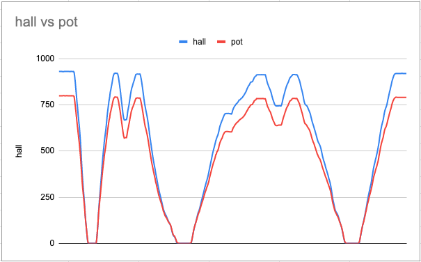
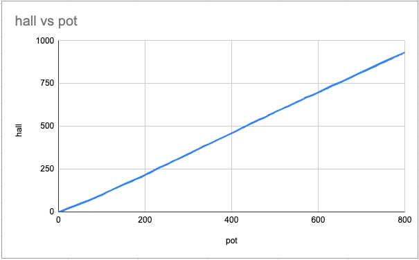
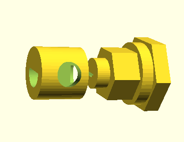
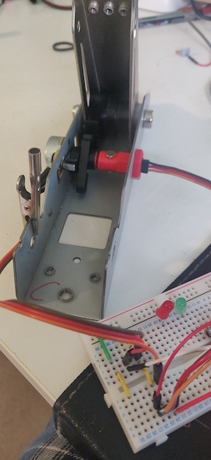
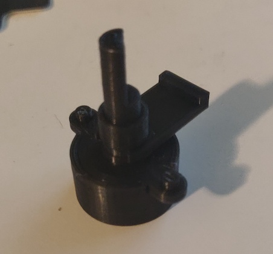
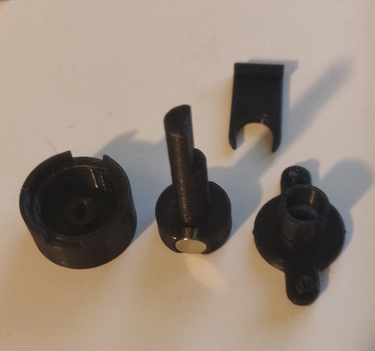

# G29 Hall Sensor Mod

Modification to replace the stock potentiometers in the G29/G27 pedals with hall sensors

There are two alternative designs in this repo

1. modification using the original pot as part of the magnet holder assembly
2. complete replacement of the original pot with a 3D printed design

Both designs require some additonal additonal parts to accompany the 3D model

1. 2x 6mm Diameter 3mm high magnets
2. [A1324](https://docs.rs-online.com/958c/0900766b813d193a.pdf) hall effect sensor 

# Hall Sensor

Over the 70 degrees rotation the pedal rotates the pot axis, the output of the A1314 is very linear.  The chart below shows the output of the sensor compares to the output of the pot whilst both are connected in the same pedal:

The next chart shows an XY scatter of the pot vs the hall sensor readings for each sample taken:

The units of each plot are the 10 bit reading of the ADC in a Pro Micro Arduino

The A1324 is rated at 5V, but it was found during testing that it actually works at 3.3V, so it appears to be completely compatible with the G29.  There is however another variant, the [A1319](https://docs.rs-online.com/1a99/0900766b815eefb8.pdf), which is rated at 3.3V

# mod design

This design engages with the stock potentiometer, using it as the base of the magenet holder.

There are two alternatives to this design:

1. where the sensor leads exit the side of the assembly [model](mod/stl/side-exit-explode.stl)
2. where the sesnor leads exit inside the assembly and therefore inside the pedal base [model](mod/stl/inner-exit-explode.stl)

# replacement design

This completely replaces the stock potentiometer with a 3D printed replacement.  The tolerances are pretty tight, but can be relaxed a little with some additional silicone grease or suitable alternative.

## STL

* [explode](pot/stl/explode.stl)
* [clip](pot/stl/clip.stl)
* [front](pot/stl/front.stl)
* [mag-holder](pot/stl/mag-holder.stl)
* [sensor-holder](pot/stl/sensor-holder.stl)

# reference

If you want to see how things took shape or throw in suggestions you can find some of the musings on racedepartment: https://www.racedepartment.com/threads/g27-g29-hall-sensor-mod.190696/

* A1324 (https://docs.rs-online.com/958c/0900766b813d193a.pdf)
* A1319 (https://docs.rs-online.com/1a99/0900766b815eefb8.pdf)